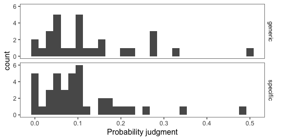
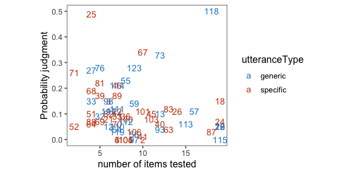
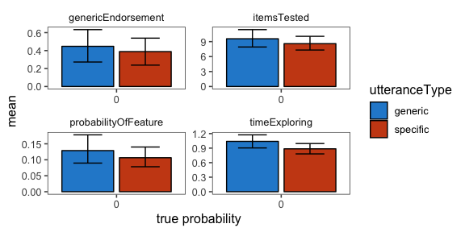

Analysis of pilot data 8 for genex
================

-   20 blickets
-   incentivized version
-   squeaking (3pt) before ringing (1pt)
-   better instructions, parallel practice

<!-- -->

    ## ── Attaching packages ────────────────────────────────────────────────────────── tidyverse 1.2.1 ──

    ## ✔ ggplot2 3.1.0     ✔ purrr   0.2.5
    ## ✔ tibble  1.4.2     ✔ dplyr   0.7.8
    ## ✔ tidyr   0.8.2     ✔ stringr 1.3.1
    ## ✔ readr   1.3.1     ✔ forcats 0.3.0

    ## ── Conflicts ───────────────────────────────────────────────────────────── tidyverse_conflicts() ──
    ## ✖ dplyr::filter()  masks stats::filter()
    ## ✖ purrr::flatten() masks jsonlite::flatten()
    ## ✖ dplyr::lag()     masks stats::lag()

Comprehension and attention checks
----------------------------------

    ## # A tibble: 3 x 2
    ## # Groups:   attemptNumber [3]
    ##   attemptNumber     n
    ##           <int> <int>
    ## 1             1    18
    ## 2             2     7
    ## 3             3     6

| key                |    n|
|:-------------------|----:|
| comp\_pass\_n      |   36|
| comp\_pass\_order  |   34|
| comp\_pass\_points |   33|
| comp\_pass\_same   |   34|

#### Number of subjects

``` r
num.subjects <- df.trials %>%
  group_by(utteranceType, proportionSuccess, include) %>%
  count()
num.subjects
```

    ## # A tibble: 2 x 4
    ## # Groups:   utteranceType, proportionSuccess, include [2]
    ##   utteranceType proportionSuccess include     n
    ##   <chr>                     <int> <lgl>   <int>
    ## 1 specific                      0 FALSE      13
    ## 2 specific                      0 TRUE       23

Free response data (with other data)
------------------------------------

Explanation of columns:

-   pass = passed attention checks
-   worked = did the blickets you tested squeak?
-   reasoning = why or why not?
-   n = number of items tested
-   t = time exploring (in minutes)
-   prob = probability that next blicket will squeak
-   gen = "Blickets squeak" true or false?
-   teach = what would you tell the children?

<!-- -->

    ## Joining, by = "subj"

|  subj| utterance | include | worked | reasoning                                                                                                                                                       |    n|     t|  prob|  gen| teach                                                                                                     | comp\_pass\_n | comp\_pass\_order | comp\_pass\_points | comp\_pass\_same |
|-----:|:----------|:--------|:-------|:----------------------------------------------------------------------------------------------------------------------------------------------------------------|----:|-----:|-----:|----:|:----------------------------------------------------------------------------------------------------------|:--------------|:------------------|:-------------------|:-----------------|
|     0| specific  | FALSE   | Yes    | it come to squeak                                                                                                                                               |    1|  0.46|  0.91|    1| about knowledgeable and fun                                                                               | TRUE          | FALSE             | FALSE              | TRUE             |
|     1| specific  | FALSE   | No     | So I would earn less bonus money.                                                                                                                               |   13|  1.40|  0.01|    1| The blickets rang more than squeak                                                                        | TRUE          | TRUE              | FALSE              | TRUE             |
|     2| specific  | TRUE    | No     | I think that happened to reduce the chance of the participant gaining the most points.                                                                          |   10|  1.21|  0.00|    0| I know that the likelihood of a blicket squeaking is extremely low compared to it ringing.                | TRUE          | TRUE              | TRUE               | TRUE             |
|     3| specific  | TRUE    | No     | most blickets do not squeak                                                                                                                                     |    6|  0.40|  0.15|    0| most blickets ring                                                                                        | TRUE          | TRUE              | TRUE               | TRUE             |
|     4| specific  | TRUE    | No     | The aim was to see if you would continue to check other blickets for squeaking, until you realize that none of them will work and you switch to ringing.        |    7|  0.88|  0.00|    1| Blickets seems to have a much higher chance of ringing than they do squeaking.                            | TRUE          | TRUE              | TRUE               | TRUE             |
|     5| specific  | TRUE    | No     | I think the blicket with the note was the only one that would squeak and that's what the note was trying to tell me, as opposed to that any other would squeak. |    7|  0.53|  0.00|    0| Blickets almost always RING                                                                               | TRUE          | TRUE              | TRUE               | TRUE             |
|     6| specific  | FALSE   | No     | I dont think any can squeak                                                                                                                                     |    3|  0.65|  0.25|    0| blickets ring                                                                                             | TRUE          | TRUE              | TRUE               | TRUE             |
|     7| specific  | FALSE   | No     | to see how long it takes to give up on the squeak                                                                                                               |    5|  0.47|  0.11|    1| most do not squeak but they do ring                                                                       | TRUE          | TRUE              | TRUE               | TRUE             |
|     8| specific  | FALSE   | Yes    | Good thinking                                                                                                                                                   |    7|  0.64|  0.76|    1| This is good and easy                                                                                     | TRUE          | FALSE             | TRUE               | FALSE            |
|     9| specific  | TRUE    | No     | It was a trick.                                                                                                                                                 |   13|  0.99|  0.04|    1| Most will ring so don't waste time on squeak.                                                             | TRUE          | TRUE              | TRUE               | TRUE             |
|    10| specific  | TRUE    | No     | Because only one blicket was allowed to squeak                                                                                                                  |    4|  0.95|  0.06|    1| Most of the Blickets Ring, but you will be able to make one Blicket squeak if its the first one you pick. | TRUE          | TRUE              | TRUE               | TRUE             |
|    11| specific  | FALSE   | Yes    | The random number generator is bad.                                                                                                                             |   19|  1.34|  0.98|    1| Most of them don't squeak.                                                                                | TRUE          | TRUE              | TRUE               | TRUE             |
|    12| specific  | TRUE    | No     | Maybe my fellow scientist already tested them all.                                                                                                              |    7|  1.04|  0.05|    0| The vast majority of blinkets ring. Squeaking blinkets are rare.                                          | TRUE          | TRUE              | TRUE               | TRUE             |
|    13| specific  | TRUE    | Yes    | Yes.                                                                                                                                                            |   10|  0.49|  0.34|    1| They sometimes squeak, but not often. They often ring.                                                    | TRUE          | TRUE              | TRUE               | TRUE             |
|    14| specific  | TRUE    | No     | A general mutation in one of them but not the rest                                                                                                              |    4|  0.35|  0.19|    0| I think the blickets ring more often then they squeak                                                     | TRUE          | TRUE              | TRUE               | TRUE             |
|    15| specific  | TRUE    | No     | The blickets generally ring.                                                                                                                                    |    5|  0.47|  0.07|    0| Only one blicket squeaked so I think it was an anomaly.                                                   | TRUE          | TRUE              | TRUE               | TRUE             |
|    16| specific  | FALSE   | No     | was a test to see how many I would test for squeaking and get wrong before I switch to ring                                                                     |    7|  0.83|  0.06|    1| Blickets can squeak or ring                                                                               | TRUE          | TRUE              | FALSE              | TRUE             |
|    17| specific  | TRUE    | Yes    | it was one that squeaked had been tested before                                                                                                                 |    2|  1.01|  0.26|    1| blickets can either squeak or ring but most ring rather then squeak                                       | TRUE          | TRUE              | TRUE               | TRUE             |
|    18| specific  | TRUE    | No     | I think it may have been the only one to squeak of the bunch.                                                                                                   |    5|  0.60|  0.22|    1| Some squeak whiles most others ring.                                                                      | TRUE          | TRUE              | TRUE               | TRUE             |
|    19| specific  | TRUE    | No     | I don't know                                                                                                                                                    |    6|  0.66|  0.10|    0| blickets ring, but very rarely they might squeak                                                          | TRUE          | TRUE              | TRUE               | TRUE             |
|    20| specific  | TRUE    | No     | i'm not sure                                                                                                                                                    |   13|  0.76|  0.12|    0| only one blinket squeeked out of all of them                                                              | TRUE          | TRUE              | TRUE               | TRUE             |
|    21| specific  | FALSE   | No     | I don't know.                                                                                                                                                   |   19|  0.71|  0.01|    1| An extremely small percentage of blickets squeak.                                                         | TRUE          | TRUE              | TRUE               | TRUE             |
|    22| specific  | FALSE   | No     | I think it is rare for them to squeak                                                                                                                           |   19|  2.20|  0.09|    1| Only one of the squeaks                                                                                   | TRUE          | TRUE              | TRUE               | FALSE            |
|    23| specific  | FALSE   | No     | I dont know                                                                                                                                                     |   19|  0.81|  0.56|    1| the make noises                                                                                           | TRUE          | TRUE              | TRUE               | TRUE             |
|    24| specific  | TRUE    | No     | I think most blickets do not squeak, which is why my fellow astronaut left me a note for the one that did.                                                      |   18|  1.39|  0.03|    0| I tested 19 blickets for squeaking, and only the first one squeaked.                                      | TRUE          | TRUE              | TRUE               | TRUE             |
|    25| specific  | TRUE    | No     | I presume squeaking is just very rare.                                                                                                                          |    4|  1.13|  0.07|    0| The vast majority of blickets ring, while very few squeak.                                                | TRUE          | TRUE              | TRUE               | TRUE             |
|    26| specific  | TRUE    | No     | I think that was a rarity, the squeaking.                                                                                                                       |    7|  1.02|  0.17|    0| Most blickets ring                                                                                        | TRUE          | TRUE              | TRUE               | TRUE             |
|    27| specific  | FALSE   | No     | They are the majority species.                                                                                                                                  |    1|  1.55|  0.97|    1| They either squeak or they ring.                                                                          | TRUE          | TRUE              | TRUE               | TRUE             |
|    28| specific  | TRUE    | No     | I think the squeaking one was broken.                                                                                                                           |    8|  0.73|  0.08|    0| There are only 1 in 20 (roughly) that will squeak.                                                        | TRUE          | TRUE              | TRUE               | TRUE             |
|    29| specific  | TRUE    | No     | I have absolutely no clue as to why or why not that happened.                                                                                                   |   10|  0.86|  0.11|    0| blickets will most likely ring                                                                            | TRUE          | TRUE              | TRUE               | TRUE             |
|    30| specific  | FALSE   | Yes    | There was only a single squeker                                                                                                                                 |   10|  0.76|  0.04|    0| Most blickets will ring                                                                                   | TRUE          | TRUE              | TRUE               | TRUE             |
|    31| specific  | TRUE    | No     | I think the rest of the blickets did not squeak because blickets rarely squeak                                                                                  |   11|  0.62|  0.08|    1| Blickets rarely squeak. They mainly ring.                                                                 | TRUE          | TRUE              | TRUE               | TRUE             |
|    32| specific  | TRUE    | No     | I can't tell what happened                                                                                                                                      |    8|  1.37|  0.00|    0| Only one of them squeaks. The rest rings                                                                  | TRUE          | TRUE              | TRUE               | TRUE             |
|    33| specific  | TRUE    | No     | Because a blicket squeaking is very rare, all blickets ring, not every blicket squeaks.                                                                         |    8|  0.88|  0.00|    0| Blickets are objects that ring, though they have been observed to squeak on rare occasion.                | TRUE          | TRUE              | TRUE               | TRUE             |
|    34| specific  | TRUE    | No     | Blickets ring mostly.                                                                                                                                           |    9|  0.88|  0.03|    0| Most blickets ring.                                                                                       | TRUE          | TRUE              | TRUE               | TRUE             |
|    35| specific  | FALSE   | No     | I think it was predetermined to squeak.                                                                                                                         |   13|  0.93|  0.02|    0| Blickets ring!                                                                                            | TRUE          | TRUE              | TRUE               | TRUE             |

Time exploring
--------------


Objects tested
--------------


Probability judgment
--------------------

    ## `stat_bin()` using `bins = 30`. Pick better value with `binwidth`.



Items tested vs. probability judgment
-------------------------------------



All measures (means and 95% CI)
-------------------------------


