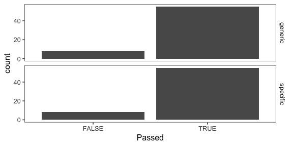
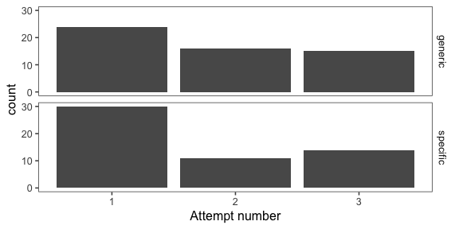
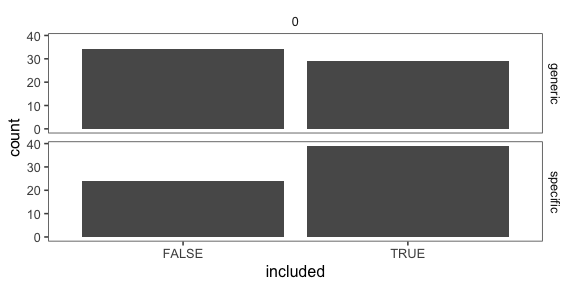
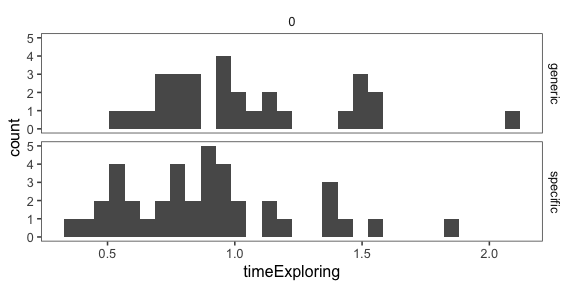
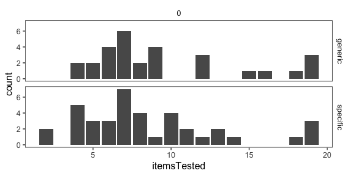

Analysis of pilot data 8 for genex
================

-   20 blickets
-   incentivized version
-   squeaking (3pt) before ringing (1pt)
-   better instructions, parallel practice

<!-- -->

    ## ── Attaching packages ────────────────────────────────────────────────────────── tidyverse 1.2.1 ──

    ## ✔ ggplot2 3.1.0     ✔ purrr   0.2.5
    ## ✔ tibble  1.4.2     ✔ dplyr   0.7.8
    ## ✔ tidyr   0.8.2     ✔ stringr 1.3.1
    ## ✔ readr   1.3.1     ✔ forcats 0.3.0

    ## ── Conflicts ───────────────────────────────────────────────────────────── tidyverse_conflicts() ──
    ## ✖ dplyr::filter()  masks stats::filter()
    ## ✖ purrr::flatten() masks jsonlite::flatten()
    ## ✖ dplyr::lag()     masks stats::lag()

Comprehension and attention checks
----------------------------------



    ## $title
    ## [1] "Comprehension checks"
    ## 
    ## attr(,"class")
    ## [1] "labels"



    ## $title
    ## [1] "Passed comprehension checks"
    ## 
    ## attr(,"class")
    ## [1] "labels"

| key                |    n|
|:-------------------|----:|
| comp\_pass\_n      |   71|
| comp\_pass\_order  |   68|
| comp\_pass\_points |   63|
| comp\_pass\_same   |   67|

Number of subjects
------------------

``` r
num.subjects <- df.trials %>%
  group_by(utteranceType, proportionSuccess, include) %>%
  count()
df.trials %>%
  ggplot(aes(x = include)) +
  geom_bar() +
  facet_grid(utteranceType ~ proportionSuccess) +
  xlab("included")
```



``` r
  ggtitle("Included participants")
```

    ## $title
    ## [1] "Included participants"
    ## 
    ## attr(,"class")
    ## [1] "labels"

Free response data (with other data)
------------------------------------

Explanation of columns:

-   pass = passed attention checks
-   worked = did the blickets you tested squeak?
-   reasoning = why or why not?
-   n = number of items tested
-   t = time exploring (in minutes)
-   prob = probability that next blicket will squeak
-   gen = "Blickets squeak" true or false?
-   teach = what would you tell the children?

<!-- -->

    ## Joining, by = "subj"

|  subj| utterance | include | worked | reasoning                                                                                                                                                       |    n|     t|  prob|  gen| teach                                                                                                                                                                                          | comp\_pass\_n | comp\_pass\_order | comp\_pass\_points | comp\_pass\_same |
|-----:|:----------|:--------|:-------|:----------------------------------------------------------------------------------------------------------------------------------------------------------------|----:|-----:|-----:|----:|:-----------------------------------------------------------------------------------------------------------------------------------------------------------------------------------------------|:--------------|:------------------|:-------------------|:-----------------|
|     0| specific  | FALSE   | Yes    | it come to squeak                                                                                                                                               |    1|  0.46|  0.91|    1| about knowledgeable and fun                                                                                                                                                                    | TRUE          | FALSE             | FALSE              | TRUE             |
|     1| specific  | FALSE   | No     | So I would earn less bonus money.                                                                                                                               |   13|  1.40|  0.01|    1| The blickets rang more than squeak                                                                                                                                                             | TRUE          | TRUE              | FALSE              | TRUE             |
|     2| specific  | TRUE    | No     | I think that happened to reduce the chance of the participant gaining the most points.                                                                          |   10|  1.21|  0.00|    0| I know that the likelihood of a blicket squeaking is extremely low compared to it ringing.                                                                                                     | TRUE          | TRUE              | TRUE               | TRUE             |
|     3| specific  | TRUE    | No     | most blickets do not squeak                                                                                                                                     |    6|  0.40|  0.15|    0| most blickets ring                                                                                                                                                                             | TRUE          | TRUE              | TRUE               | TRUE             |
|     4| specific  | TRUE    | No     | The aim was to see if you would continue to check other blickets for squeaking, until you realize that none of them will work and you switch to ringing.        |    7|  0.88|  0.00|    1| Blickets seems to have a much higher chance of ringing than they do squeaking.                                                                                                                 | TRUE          | TRUE              | TRUE               | TRUE             |
|     5| specific  | TRUE    | No     | I think the blicket with the note was the only one that would squeak and that's what the note was trying to tell me, as opposed to that any other would squeak. |    7|  0.53|  0.00|    0| Blickets almost always RING                                                                                                                                                                    | TRUE          | TRUE              | TRUE               | TRUE             |
|     6| specific  | FALSE   | No     | I dont think any can squeak                                                                                                                                     |    3|  0.65|  0.25|    0| blickets ring                                                                                                                                                                                  | TRUE          | TRUE              | TRUE               | TRUE             |
|     7| specific  | FALSE   | No     | to see how long it takes to give up on the squeak                                                                                                               |    5|  0.47|  0.11|    1| most do not squeak but they do ring                                                                                                                                                            | TRUE          | TRUE              | TRUE               | TRUE             |
|     8| specific  | FALSE   | Yes    | Good thinking                                                                                                                                                   |    7|  0.64|  0.76|    1| This is good and easy                                                                                                                                                                          | TRUE          | FALSE             | TRUE               | FALSE            |
|     9| generic   | TRUE    | Yes    | A few did - just probability                                                                                                                                    |    6|  0.65|  0.11|    1| They are more likely to ring than squeak                                                                                                                                                       | TRUE          | TRUE              | TRUE               | TRUE             |
|    10| generic   | FALSE   | No     | most rang                                                                                                                                                       |    3|  0.99|  0.17|    1| a few blickets squeek while many will ring                                                                                                                                                     | TRUE          | FALSE             | FALSE              | TRUE             |
|    11| generic   | FALSE   | No     | I believe I was being tested on how long it would take before I would switch to testing for ringing.                                                            |    6|  1.21|  0.07|    1| All I know is that blickets are supposed to squeak.                                                                                                                                            | TRUE          | TRUE              | TRUE               | TRUE             |
|    12| generic   | TRUE    | Yes    | I'm not sure                                                                                                                                                    |    6|  0.78|  0.05|    0| They have a rare chance to squeak, but most of the time ring.                                                                                                                                  | TRUE          | TRUE              | TRUE               | TRUE             |
|    13| generic   | TRUE    | No     | Because only one squeaked.                                                                                                                                      |   12|  1.05|  0.10|    0| Blickets squeak.                                                                                                                                                                               | TRUE          | TRUE              | TRUE               | TRUE             |
|    14| generic   | TRUE    | No     | i don't know                                                                                                                                                    |    7|  0.87|  0.10|    0| not many of them squeak. many of them ring                                                                                                                                                     | TRUE          | TRUE              | TRUE               | TRUE             |
|    15| generic   | FALSE   | No     | I think they mostly rang.                                                                                                                                       |    1|  0.32|  0.51|    1| Some sqeak most ring                                                                                                                                                                           | TRUE          | TRUE              | TRUE               | TRUE             |
|    16| generic   | FALSE   | No     | Not sure. Perhaps because squeaks pay more!                                                                                                                     |    9|  3.20|  0.10|    1| More blickets ring than squeak                                                                                                                                                                 | TRUE          | TRUE              | TRUE               | TRUE             |
|    17| generic   | FALSE   | No     | Not sure                                                                                                                                                        |   12|  0.83|  0.11|    0| Most of the blickets will ring                                                                                                                                                                 | TRUE          | TRUE              | TRUE               | TRUE             |
|    18| specific  | TRUE    | No     | It was a trick.                                                                                                                                                 |   13|  0.99|  0.04|    1| Most will ring so don't waste time on squeak.                                                                                                                                                  | TRUE          | TRUE              | TRUE               | TRUE             |
|    19| specific  | TRUE    | No     | Because only one blicket was allowed to squeak                                                                                                                  |    4|  0.95|  0.06|    1| Most of the Blickets Ring, but you will be able to make one Blicket squeak if its the first one you pick.                                                                                      | TRUE          | TRUE              | TRUE               | TRUE             |
|    20| specific  | FALSE   | Yes    | The random number generator is bad.                                                                                                                             |   19|  1.34|  0.98|    1| Most of them don't squeak.                                                                                                                                                                     | TRUE          | TRUE              | TRUE               | TRUE             |
|    21| specific  | TRUE    | No     | Maybe my fellow scientist already tested them all.                                                                                                              |    7|  1.04|  0.05|    0| The vast majority of blinkets ring. Squeaking blinkets are rare.                                                                                                                               | TRUE          | TRUE              | TRUE               | TRUE             |
|    22| specific  | TRUE    | Yes    | Yes.                                                                                                                                                            |   10|  0.49|  0.34|    1| They sometimes squeak, but not often. They often ring.                                                                                                                                         | TRUE          | TRUE              | TRUE               | TRUE             |
|    23| specific  | TRUE    | No     | A general mutation in one of them but not the rest                                                                                                              |    4|  0.35|  0.19|    0| I think the blickets ring more often then they squeak                                                                                                                                          | TRUE          | TRUE              | TRUE               | TRUE             |
|    24| specific  | TRUE    | No     | The blickets generally ring.                                                                                                                                    |    5|  0.47|  0.07|    0| Only one blicket squeaked so I think it was an anomaly.                                                                                                                                        | TRUE          | TRUE              | TRUE               | TRUE             |
|    25| specific  | FALSE   | No     | was a test to see how many I would test for squeaking and get wrong before I switch to ring                                                                     |    7|  0.83|  0.06|    1| Blickets can squeak or ring                                                                                                                                                                    | TRUE          | TRUE              | FALSE              | TRUE             |
|    26| specific  | TRUE    | Yes    | it was one that squeaked had been tested before                                                                                                                 |    2|  1.01|  0.26|    1| blickets can either squeak or ring but most ring rather then squeak                                                                                                                            | TRUE          | TRUE              | TRUE               | TRUE             |
|    27| generic   | TRUE    | No     | I trusted a note that was false.                                                                                                                                |   19|  0.81|  0.05|    0| Blickets sometimes squeak but it is possible that they ring.                                                                                                                                   | TRUE          | TRUE              | TRUE               | TRUE             |
|    28| generic   | TRUE    | No     | only one was a real blicket                                                                                                                                     |   12|  1.48|  0.33|    1| most blickets ring but some squeak                                                                                                                                                             | TRUE          | TRUE              | TRUE               | TRUE             |
|    29| generic   | FALSE   | No     | Due to the testing condition that only one blicket squeaked while the others rang.                                                                              |    1|  0.51|  0.03|    1| Blickets can either squeak or ring. However, blickets that squeak earn three points and blickets that ring earn one point. However can only test a blicket once to see if they squeak or ring. | TRUE          | TRUE              | TRUE               | TRUE             |
|    30| generic   | FALSE   | No     | Because it is their characteristic to ring                                                                                                                      |    7|  1.16|  0.77|    0| Blickets can squeaks or ring. My opinion is that mostly ring                                                                                                                                   | TRUE          | FALSE             | TRUE               | FALSE            |
|    31| generic   | TRUE    | Yes    | don't know                                                                                                                                                      |    5|  1.11|  0.28|    1| blickets squeek                                                                                                                                                                                | TRUE          | TRUE              | TRUE               | TRUE             |
|    32| generic   | TRUE    | No     | It was the only one marked                                                                                                                                      |    6|  0.69|  0.06|    0| While a blicket can squeak it is much more likely to ring                                                                                                                                      | TRUE          | TRUE              | TRUE               | TRUE             |
|    33| generic   | FALSE   | No     | It was just random that they didn't squeak                                                                                                                      |   19|  1.17|  0.07|    1| A vast majority of them don't squeak                                                                                                                                                           | TRUE          | TRUE              | TRUE               | TRUE             |
|    34| generic   | FALSE   | Yes    | I think more investigation was needed before the general statement on the note could be made accurately.                                                        |    7|  0.63|  0.15|    0| Very few blickets actually squeak.                                                                                                                                                             | FALSE         | TRUE              | FALSE              | FALSE            |
|    35| generic   | FALSE   | No     | May have been a special case which is why it had a note on it.                                                                                                  |   10|  0.82|  0.00|    0| Blickets ring more often than they squeak.                                                                                                                                                     | TRUE          | TRUE              | FALSE              | TRUE             |
|    36| specific  | FALSE   | No     | I think it may have been the only one to squeak of the bunch.                                                                                                   |    5|  0.60|  0.22|    1| Some squeak whiles most others ring.                                                                                                                                                           | TRUE          | TRUE              | TRUE               | TRUE             |
|    37| specific  | TRUE    | No     | I don't know                                                                                                                                                    |    6|  0.66|  0.10|    0| blickets ring, but very rarely they might squeak                                                                                                                                               | TRUE          | TRUE              | TRUE               | TRUE             |
|    38| specific  | TRUE    | No     | i'm not sure                                                                                                                                                    |   13|  0.76|  0.12|    0| only one blinket squeeked out of all of them                                                                                                                                                   | TRUE          | TRUE              | TRUE               | TRUE             |
|    39| specific  | FALSE   | No     | I don't know.                                                                                                                                                   |   19|  0.71|  0.01|    1| An extremely small percentage of blickets squeak.                                                                                                                                              | TRUE          | TRUE              | TRUE               | TRUE             |
|    40| specific  | FALSE   | No     | I think it is rare for them to squeak                                                                                                                           |   19|  2.20|  0.09|    1| Only one of the squeaks                                                                                                                                                                        | TRUE          | TRUE              | TRUE               | FALSE            |
|    41| specific  | FALSE   | No     | I dont know                                                                                                                                                     |   19|  0.81|  0.56|    1| the make noises                                                                                                                                                                                | TRUE          | TRUE              | TRUE               | TRUE             |
|    42| specific  | TRUE    | No     | I think most blickets do not squeak, which is why my fellow astronaut left me a note for the one that did.                                                      |   18|  1.39|  0.03|    0| I tested 19 blickets for squeaking, and only the first one squeaked.                                                                                                                           | TRUE          | TRUE              | TRUE               | TRUE             |
|    43| specific  | TRUE    | No     | I presume squeaking is just very rare.                                                                                                                          |    4|  1.13|  0.07|    0| The vast majority of blickets ring, while very few squeak.                                                                                                                                     | TRUE          | TRUE              | TRUE               | TRUE             |
|    44| specific  | TRUE    | No     | I think that was a rarity, the squeaking.                                                                                                                       |    7|  1.02|  0.17|    0| Most blickets ring                                                                                                                                                                             | TRUE          | TRUE              | TRUE               | TRUE             |
|    45| specific  | FALSE   | No     | They are the majority species.                                                                                                                                  |    1|  1.55|  0.97|    1| They either squeak or they ring.                                                                                                                                                               | TRUE          | TRUE              | TRUE               | TRUE             |
|    46| specific  | TRUE    | No     | I think the squeaking one was broken.                                                                                                                           |    8|  0.73|  0.08|    0| There are only 1 in 20 (roughly) that will squeak.                                                                                                                                             | TRUE          | TRUE              | TRUE               | TRUE             |
|    47| specific  | TRUE    | No     | I have absolutely no clue as to why or why not that happened.                                                                                                   |   10|  0.86|  0.11|    0| blickets will most likely ring                                                                                                                                                                 | TRUE          | TRUE              | TRUE               | TRUE             |
|    48| specific  | FALSE   | Yes    | There was only a single squeker                                                                                                                                 |   10|  0.76|  0.04|    0| Most blickets will ring                                                                                                                                                                        | TRUE          | TRUE              | TRUE               | TRUE             |
|    49| specific  | TRUE    | No     | I think the rest of the blickets did not squeak because blickets rarely squeak                                                                                  |   11|  0.62|  0.08|    1| Blickets rarely squeak. They mainly ring.                                                                                                                                                      | TRUE          | TRUE              | TRUE               | TRUE             |
|    50| specific  | TRUE    | No     | I can't tell what happened                                                                                                                                      |    8|  1.37|  0.00|    0| Only one of them squeaks. The rest rings                                                                                                                                                       | TRUE          | TRUE              | TRUE               | TRUE             |
|    51| specific  | TRUE    | No     | Because a blicket squeaking is very rare, all blickets ring, not every blicket squeaks.                                                                         |    8|  0.88|  0.00|    0| Blickets are objects that ring, though they have been observed to squeak on rare occasion.                                                                                                     | TRUE          | TRUE              | TRUE               | TRUE             |
|    52| specific  | TRUE    | No     | Blickets ring mostly.                                                                                                                                           |    9|  0.88|  0.03|    0| Most blickets ring.                                                                                                                                                                            | TRUE          | TRUE              | TRUE               | TRUE             |
|    53| specific  | FALSE   | No     | I think it was predetermined to squeak.                                                                                                                         |   13|  0.93|  0.02|    0| Blickets ring!                                                                                                                                                                                 | TRUE          | TRUE              | TRUE               | TRUE             |
|    54| generic   | FALSE   | No     | because                                                                                                                                                         |    9|  1.18|  0.10|    1| only one squeaked. the remainder rang.                                                                                                                                                         | TRUE          | TRUE              | FALSE              | TRUE             |
|    55| generic   | FALSE   | No     | I think that was the only one that squeaked                                                                                                                     |    1|  0.37|  0.57|    1| blickets squeak and are a diamond shape                                                                                                                                                        | TRUE          | TRUE              | TRUE               | TRUE             |
|    56| generic   | TRUE    | No     | Because not many squeak                                                                                                                                         |    7|  1.43|  0.05|    1| Blickets squeak                                                                                                                                                                                | TRUE          | TRUE              | TRUE               | TRUE             |
|    57| generic   | TRUE    | No     | I am not sure why that happened.                                                                                                                                |    7|  1.19|  0.12|    0| Most blikets ring. Very few squeak.                                                                                                                                                            | TRUE          | TRUE              | TRUE               | TRUE             |
|    58| generic   | TRUE    | No     | to keep from paying a good bonus                                                                                                                                |    8|  0.57|  0.07|    1| they squeak                                                                                                                                                                                    | TRUE          | TRUE              | TRUE               | TRUE             |
|    59| generic   | TRUE    | No     | Many do not squeak. It may have been a fluke the one that did squeak.                                                                                           |   15|  1.57|  0.06|    0| Most, if not all, blickets do not squeek. At least some, however, ring.                                                                                                                        | TRUE          | TRUE              | TRUE               | TRUE             |
|    60| generic   | TRUE    | No     | I suppose that the sometimes or rarely they do, but MOSTLY they ring.                                                                                           |    7|  0.71|  0.21|    0| Rarely they squeak, but most of the time they ring.                                                                                                                                            | TRUE          | TRUE              | TRUE               | TRUE             |
|    61| generic   | TRUE    | No     | I have no idea.                                                                                                                                                 |   19|  0.97|  0.00|    1| That they squeak.                                                                                                                                                                              | TRUE          | TRUE              | TRUE               | TRUE             |
|    62| generic   | FALSE   | No     | It seems like they more likely ring                                                                                                                             |    7|  0.67|  0.15|    0| it seems like blickets ring                                                                                                                                                                    | TRUE          | TRUE              | TRUE               | TRUE             |
|    63| generic   | TRUE    | No     | I do not know                                                                                                                                                   |    6|  0.93|  0.11|    1| blickets squak                                                                                                                                                                                 | TRUE          | TRUE              | TRUE               | TRUE             |
|    64| generic   | TRUE    | No     | Maybe those blickets would ring, if I had tested for ringing. I continued to test for squeaking.                                                                |   18|  2.09|  0.50|    1| Some blickets squeak and some blickets ring.                                                                                                                                                   | TRUE          | TRUE              | TRUE               | TRUE             |
|    65| generic   | TRUE    | No     | Because you want to see how long it would take us to switch to the safer, less riskier option if we couldn't get the better paying option.                      |    7|  0.71|  0.03|    0| They mostly ring.                                                                                                                                                                              | TRUE          | TRUE              | TRUE               | TRUE             |
|    66| generic   | FALSE   | No     | not many blickets squeak                                                                                                                                        |   10|  1.05|  0.14|    0| blickets ring                                                                                                                                                                                  | TRUE          | TRUE              | TRUE               | TRUE             |
|    67| generic   | FALSE   | No     | because they usually do not squeak buyt ring                                                                                                                    |    1|  0.57|  0.82|    1| blickets squeak very rarely but do ring                                                                                                                                                        | TRUE          | TRUE              | FALSE              | TRUE             |
|    68| generic   | FALSE   | Yes    | They're more likely to ring.                                                                                                                                    |    9|  0.80|  0.33|    1| Blickets have a higher chance of ringing.                                                                                                                                                      | TRUE          | TRUE              | TRUE               | FALSE            |
|    69| generic   | TRUE    | No     | Because they weren't suppose to.                                                                                                                                |    9|  1.47|  0.28|    0| Blickets squeak                                                                                                                                                                                | TRUE          | TRUE              | TRUE               | TRUE             |
|    70| generic   | FALSE   | No     | No they rung                                                                                                                                                    |    1|  0.67|  0.26|    0| Most of them will most defiantly will ring                                                                                                                                                     | TRUE          | TRUE              | TRUE               | TRUE             |
|    71| generic   | FALSE   | No     | No idea.                                                                                                                                                        |    6|  0.59|  0.22|    1| they squeak                                                                                                                                                                                    | TRUE          | TRUE              | FALSE              | TRUE             |

Time exploring
--------------



Objects tested
--------------



Probability judgment
--------------------

    ## `stat_bin()` using `bins = 30`. Pick better value with `binwidth`.


Items tested vs. probability judgment
-------------------------------------


All measures (means and 95% CI)
-------------------------------


